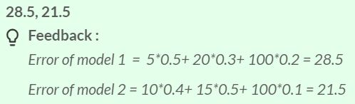

# Boosting
Boosting is one of the most powerful ideas introduced in the field of machine learning in the past few years. It was first introduced in 1997 by Freund and Schapire in the popular algorithm, AdaBoost. It was originally designed for classification problems. Since its inception, many new boosting algorithms have been developed those tackle regression problems also and have become famous as they are used in the top solutions of many Kaggle competitions. We will go through the concepts of the most popular boosting algorithms - AdaBoost, Gradient Boosting and XGBoost in this module.

## Introduction to Boosting
In this session, we will go through the basics of Boosting and move on to the AdaBoost algorithm. Let's start with the motivation of studying Boosting and look at a brief overview of the technique.

We will discuss the following different boosting methods:
1. Adaptive Boosting
2. Gradient Boosting
3. XGBoost

The key idea of boosting is to create an ensemble which makes high errors only on the less frequent data points.

Let's solve a question to understand the concept of expected error.  
Suppose you are given two models who are expected to make a certain error on some data points. The probability of occurrence of the data points are provided in the following table:

The expected error of a model is the sum of errors weighted by the probabilities of the data points on which the errors occur. Our aim is to choose a model which will minimise the total expected error.

**Expected Error**
The expected errors of models 1 and 2 are respectively.

Boosting leverages the fact that we can build a series of models specifically targeted at the data points which have been incorrectly predicted by the other models in the ensemble. If a series of models keep reducing the average error, we will have an ensemble having extremely high accuracy.

We learned that boosting is a way of generating a strong model from a weak learning algorithm. Note that here SVM, regression, and other techniques are algorithms which are used to create models. As mentioned about the function of the algorithm. It is to minimize the loss.

At this point, it is important to understand the loss functions for regression and classification problems are different. Until now, we have defined the error function for a regression setting as the sum of squared difference between the actual and the predicted values while the misclassification rate as the error function for a classification problem. We will see in the upcoming segments how the loss function is a modification of these error functions.

## Weak Learners
We shall learn the concept of weak learners and what role they play in the boosting learning algorithm.

So, here we see that a weak learning algorithm produces a model that does marginally better than a random guess. A random guess has a 50% chance of being right. Hence, any such model shall have, say 60-70% chance of being correct and the final objective is to create a strong model by making an ensemble of such weak models.

In case of decision tree, we want to have high interaction between attribute, but we have place a regularization on the depth of the tree to be 2. Then this will produce a model which will be merely better than random guess. But what we will do is we will somehow combine all these models to produce a model which is strong enough.
We saw an example of how to create a weak learner by applying a regularisation rule on the decision tree algorithm. 

Now that we understand what weak learners are, let’s see how they are combined to form an ensemble.

## AdaBoost Algorithm
We will learn how the AdaBoost algorithm improves the performance by boosting the probability of some points while suppressing the probability of others. AdaBoost stands for Adaptive Boosting, was developed by Schapire and Freund, who later on won the 2003 Godel Prize for their work.

Let us consider a binary classification problem, wherein learning algorithm will produce a model given a training set and distribution.

In above formula D is the distribution, T is the training set, p is the probability of data points.
So we start with a uniform distribution, so with each iteration the points which are continuously not handled by the learning algorithm will be assigned a high probablity, so that in subsequent iterations those points are considered and finally we will produce a ensemble of such models which will in turn have high accuracy.

We see here that the with each new model, the distribution of the data changes. By distribution, we mean that the weight assigned to each data point changes for the calculation of objective function that needs to be minimized.

In other words, objective function is the expected value of the loss which transforms to the above-mentioned objective function when the distribution is not uniform. 

**Question**

Let's now look at the questions we need to answer to create an AdaBoost learning algorithm.
So, there are essentially two steps involved in the AdaBoost algorithm:
1. Modify the current distribution to create a new distribution to generate a new model.
2. Calculation of the weights given to each of the models to get the final ensemble.

**Additional Reading:**  
A Short Introduction to Boosting' by Freund and Schapire (http://www.site.uottawa.ca/~stan/csi5387/boost-tut-ppr.pdf)

### AdaBoost Distribution and Parameter Calculation
We saw that the two basic steps involved in the AdaBoost algorithm are:
1. Modify the current distribution to create a new distribution to generate a new model
2. Calculation of the weights given to each of the models to get the final ensemble

We will explore the first step of the AdaBoost process, i.e. how the distribution changes after every iteration and the intuition behind it.

The probability assigned to different data points in the AdaBoost algorithm is as follows:

Now, let's dive into the second step of the AdaBoost process in which we look at how we assign weights to the different models we create at each step.

Since our algorithm is a weak learner, which is capable of producing a model which is marginally better than the random guess. So probablity of error by the model which this algorithm produces must be less than 1/2. So 1 - epsilon_t will be more than 1/2 and epsilon_t will be less than  1/2.

**Practical advice**: Before you apply the AdaBoost algorithm, you should remove the Outliers. Since AdaBoost tends to boosts up the probabilities of misclassified points and there is a high chance that outliers will be misclassified, it will keep increasing the probability associated with the outliers and make the progress difficult. Some of the ways to remove outliers are:
* Boxplots
* Cook's distance
* Z-score.

**Additional Reading**
The AdaBoost algorithm uses the exponential loss function, 

 to develop the expressions for the probability distribution and the weights assigned to the tree. You can go through the link mentioned for the derivation. (https://mbernste.github.io/files/notes/AdaBoost.pdf)

 ### AdaBoost Lab
 The objective of this segment is to learn how to implement the AdaBoost algorithm in python. In this exercise, you have to go through the notebook attached to the page and answer the questions that follow.

 Download and implement the code in the following notebook to get an understanding of the AdaBoostClassifier and answer the following questions. Refer to the documentation (https://scikit-learn.org/stable/modules/generated/sklearn.ensemble.AdaBoostClassifier.html#sklearn.ensemble.AdaBoostClassifier) of AdaBoostClassifier if needed

 You can try changing the number of trees in 'estimators = list(range(1, 50, 3))' to 'estimators = list(range(1, 200, 3))' and see if the acuracy increases. 

 Note that we have used 'accuracy_score' as the evaluation metric here. We can use other evaluation metrics(https://scikit-learn.org/stable/modules/model_evaluation.html) also like 'roc_auc_curve'.

 [AdaBoost Lab](dataset/Adaboost_cancer_prediction.ipynb)